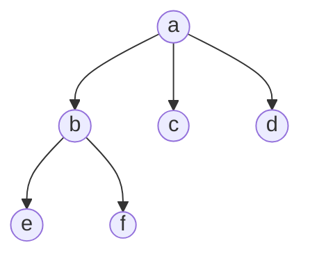
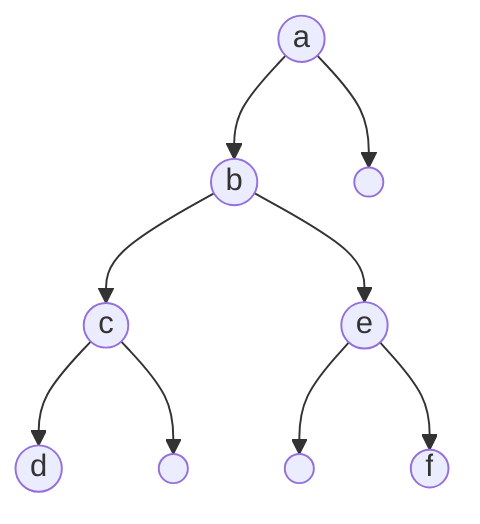

A way of creating an n-ary tree
Implemented with [[Binary Trees]] using the left node to represent siblings and right node to represent children

### Example

```mermaid
graph TD;
id1((a)) --> id2((b));
id1((a)) --> id3((c));
id1((a)) --> id4((d));
id2((b)) --> id5((e));
id2((b)) --> id6((f));

```

Would be represented by the tree

```mermaid
graph TD;
id1((a)) --> id2((b));
id1((a)) --> id7(( ));
id2((b)) --> id3((c));
id3((c)) --> id4((d));
id3((c)) --> id8(( ));
id2((b)) --> id5((e));
id5((e)) --> id9(( ));
id5((e)) --> id6((f));


```
