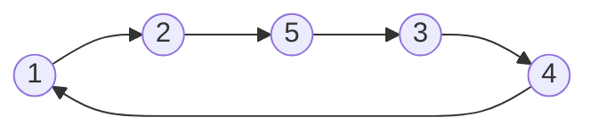

#4-4

### Defining a Function
- A function can be thought of as an ordered triple
	- (Domain, Codomain, Rule)

**Consider**
$\large f(x): \mathbb{R}\rightarrow \mathbb{R}\text{, }f(x) = e^{x}$
and
$\large g(x): \mathbb{R} \rightarrow \mathbb{R} \text{, }g(x) = e^{x}$

These are different because the codomain is different

**Functions can also be on arbitrary [[Sets|sets]]**
$\large f: A\rightarrow B$

Where $\large a \in A$ and $\large f(a)\in B$
in other words...
Graph  of $\large f = \{(a,b)|a\in A, b\in B, f(a) = b\}$

#### Finding the Domain and Range

$\large \text{domain } = \{a|(a,b)\in \text{ graph}\}$

$\large \text{range } = \{b|(a,b)\in \text{ graph}\}$

We cannot find the codomain from the graph

### Is it function?

In a function, each value $\large a$ should map to one $\large b$ (Vertical line test)

### Injective

If, in the function each value $\large a$ maps to a unique $\large b$ the function is (Horizontal line test)
- Injective
- one-to-one

$\large \forall x,y\in A(x \ne y \rightarrow f(x) \ne f(y))$
and
$\large\forall x,y\in A(f(x) = f(y) \rightarrow x=y)$ 

### Surjective

Every element of B is a result of some $\large a$ passed through the function

$\large \forall b\in B \text{ }\exists a\in A f(a) = b$
or
$\large B = \text{Range}(f)$ 

### Bijection

A function $\large f$ is bijective if $\large f$ is injective and surjective 

In a bijection, every a maps to exactly one b and vice versa
Also every element of the sets A and B have a pairing in the other set (no lonely elements)

## Examples
#### Ex. 1
**Consider**
$\large f: \mathbb{Z}\rightarrow \mathbb{Z} \text{ }f(n) = 3n+2$

We can assume $\large f(x) = f(y)$ to check if it is ==Injective==
$\large 3x+2 = 3y+2$
$\large 3x = 3y$
$\large x=y$
So the function is Injective

To prove the $\large f$ is not ==Surjective== we need to find a value that $\large f(n)$ cannot be equal to
Assume: $\large b=3 \text{, } f(a)=3$
$\large 3 = 3a+2$
$\large \frac{1}{3} = a$
$\large a\notin \mathbb{Z}$ 

#### Ex 2. 
**Consider**
$\large g: \mathbb{R}\rightarrow \mathbb{R} \text{ } g(x) = x^{2}$

This is not ==Injective==
Assume: $\large g(x) = g(y)$
$\large x^{2} = y^{2}$
$\large \sqrt{x^{2}} = \sqrt{y^{2}}$
We cannot say for sure that x = y because one could be negative

### Composition
$\large f: A\rightarrow B$
$\large g: B \rightarrow C$

$\large g\circ f: A\rightarrow C$
$\large g\circ f = g(f(x))$ 

##### Not Commutative
$\large f\circ g \ne g \circ f$

##### Associative
$\large h\circ (g \circ f) \Leftrightarrow (h \circ g)\circ f$  

### Inverse Functions
$\large f: A\rightarrow B \text{ and } g: B\rightarrow A$

If we apply $f$ and then apply $g$ we end up where we started
or:
$\large g(f(a)) = a$

##### Theorem
$\large f$ has an inverse if and only if $\large f$ is bijective.

### More Examples

**Assume A, B are finite sets and $\large|A|=|B|$**

$\large f: A\rightarrow B \text{ is injection if and only if it is surjection}$ 

Def: $\large f: A\rightarrow A$
	Is a permutation if $\large f$ is injection
	Alternatively
	$\large f$ is a permutation if $\large f$ is surjection

In a finite set, if a permutation is applied to an element a number of times, eventually the the permutation will return to the original element

Permutations will always decompose into  non-overlapping cycles

#### Permutation Example
$$\Large \binom{1}{2}\binom{2}{5}\binom{3}{4}\binom{4}{1}\binom{5}{3}$$

Forms a closed loop

$\large f'$ can be found by reversing the arrows

### Finding the number of functions on two sets

$\large \text{Number of } g: A\rightarrow B \text{ bijections } = |A|! \text{ if } |A| = |B|$ 

$\large \text{Number of } f: A\rightarrow B \text{ injections } = |B|*(|B|-1)* \text{ ... }*(|B|-|A| +1)$

$\large \text{Number of } h: A\rightarrow B \text{ surjections } = |A_{1}'\cap A_{2}'\cap \text{ ... } \cap A_{n}'|$
Where $\large n = |B|$
or $(m)^{n} - \binom{m}{1}(m-1)^{n} + \binom{m}{2}(m-2)^{n} -\text{ ... }$

# Checking functions

|                                               |                       | I   | S   | B   |
| --------------------------------------------- | --------------------- | --- | --- | --- |
| $\large f: \mathbb{R} \rightarrow \mathbb{R}$ | $\large f(x) = x^{2}$ | No  | No  | No  |
|                                               |                       |     |     |     |
|                                               |                       |     |     |     |
