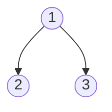

#4-2
Describes the [[Partial Order]] of a "Project" and seeks to answer the scheduling of tasks
- Compilers

Lets say we want to build something.
We have a list of tasks and what needs to be done before we can start each one

| ID  | Prereq | Time |
| --- | ------ | ---- |
| 1   | None   | 3    |
| 2   | 1      | 4    |
| 3   | 1      | 6    | 
 ...

We form a [[Directed Graph]] where each Prereq field represents a one directional relation. This also forms our Partial Order

To preform a [[Topological Sorting|Topological Sort]] we first find the nodes that have no Prereqs, and place them at the start, then the tasks that are dependent on those ...

We can give each node a final label
- The time to complete that step
final label = (time for current node) + max label of its prereqs

To get the final labels for all the nodes we do a breadth first traversal

After getting to the last node we backtrack and add up the numbers