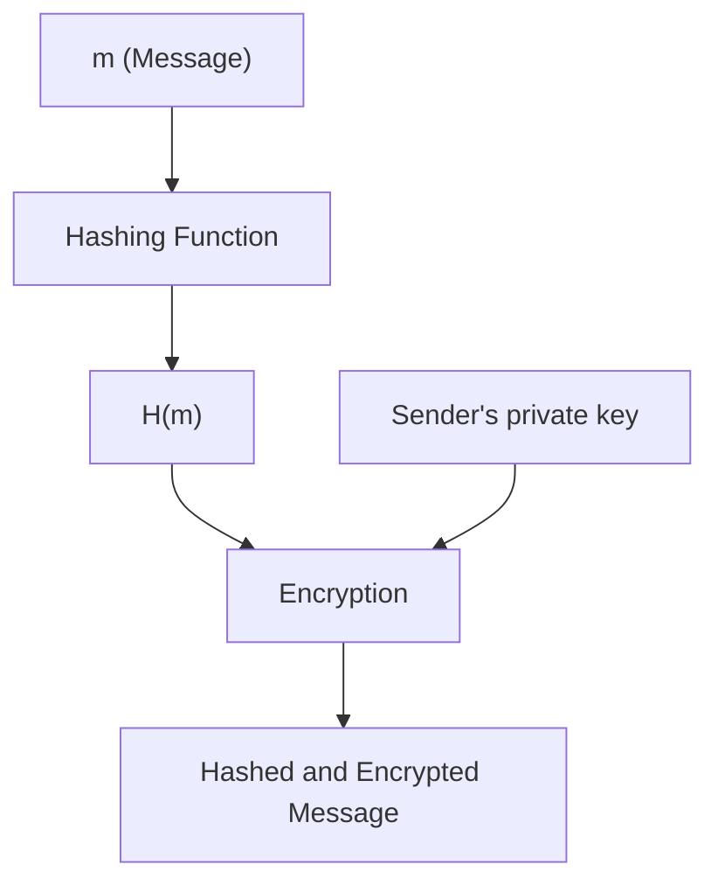

# Goal

To have a way to verify the identity of a user on a network

# Implementation

1. Sender encrypts the message with their private key and hashes it
2. Sender sends the hashed message and the encrypted version
3. Receiver decrypts the encrypted message with the sender's public key and checks to see if it matches the hashed version by passing it through the same hash function

