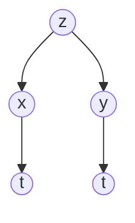
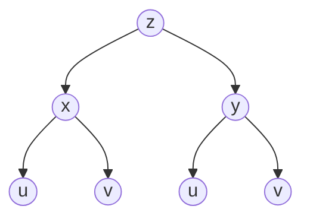
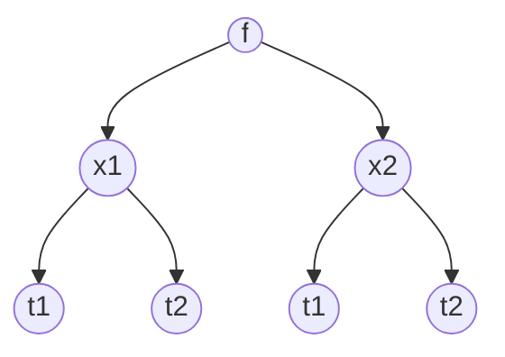

==**14.4**==

Recall the Calc 1 chain rule

$\large y=f(x(t)) \text{ then } \frac{dy}{dt} = \frac{df}{dx}* \frac{dx}{dt}$

Now, suppose that $\large z = f(x,y)$ where $\large x=x(t)$ and $\large y=y(t)$
Notice that y and x are functions of t which makes this a single variable function

Then we can find $\Large \frac{dz}{dt}$ with:
$$\large \frac{dz}{dt} = \frac{\partial z}{\partial x}\frac{dx}{dt} + \frac{\partial z}{\partial y}\frac{dy}{dt}$$
We can use this property to apply the chain rule to functions that contain multiple functions of $\large t$ 

### Example 1

$$\Large z = x^{3}y \text{ , }x=2t \text{ , } y = t^{2}$$
$\large \frac{dz}{dt} = \frac{\partial z}{\partial x}\frac{dx}{dt} + \frac{\partial z}{\partial y}\frac{dy}{dt}$

$\large \frac{dz}{dt} = (3x^{2}y)(2) + (x^{3})(2t)$

Now we substitute so that the only variable on the right is t

$\large \frac{dz}{dt} = 40t^{4}$

### Example 2

A solid right circular cylinder is heated up to that its radius, height and surface area increase

At the instant that $\large r = 10 cm$, $\large h=100cm$, r is increasing at the rate of 0.2 cm/hr and h is increasing at the rate of 0.5 cm/hr. How fast is the surface area changing at this instant?

Note that both the height and radius are dependent on the time.

$\large r = r(t) \text{ , } h=h(t)$ 

We are looking to find the surface area which is dependent on the radius and height

$\large S = S(r,h) = 2\pi r^{2} + 2\pi rh$ 

**From here we can easily compute $\Large \frac{dS}{dt}$ when $\large r=10$, $\large h=10$, $\large \frac{dr}{dt}=0.2$ and $\large \frac{dh}{dt} = 0.5$**

$\Large \frac{dS}{dt} = \frac{\partial s}{\partial r}\frac{dr}{dt}+\frac{\partial S}{\partial h}\frac{dh}{dt}$

$\large = (4\pi r+2\pi h)(0.2) + (2\pi r)(0.5)$

$\Large \frac{dS}{dt} = 58\pi$

# Extensions of the Chain Rule

Now assume that $\large z = f(x,y)$ but $\large x = x(u,v)$ and $\large y = y(u,v)$

Then $$\large \frac{\partial Z}{\partial u} = \frac{\partial Z}{\partial x}\frac{\partial x}{\partial u} + \frac{\partial Z}{\partial y}\frac{\partial y}{\partial u}$$
and $$\large \frac{\partial Z}{\partial v} = \frac{\partial Z}{\partial x}\frac{\partial x}{\partial v} + \frac{\partial Z}{\partial y}\frac{\partial y}{\partial v}$$
### Example

$\large z = 3x^{2}-y^{2}$, $\large x= 2u+7v$, and $\large y = 5uv$, 
Find $\large \frac{dZ}{dv}$ and $\large \frac{dZ}{du}$

We can use the formulas above

$\large \frac{\partial Z}{\partial u} = (6x)(2) + (-2y)(5v)$

Then we write it in terms of only u's and v's

$\large \frac{\partial Z}{\partial u} = 12(2u + 7v) -50(uv)v = 24u + 84v - 50uv^{2}$

# Generalization of Chain Rule

If $\large f = f(x_{1}, x_{2}, \text{ ... }, x_{m})$ and each $\large x_{i} = x_{i}(t_{1}, t_{2} \text{ ... }, t_{n})$
for $\large i = 1, 2, 3, \text{ ... }, m$

Then how do we find $\Large \frac{\partial f}{\partial t_{j}}$ for $\large j = 1, 2, \text{ ... }, n$

Tree showing dependencies when m and n are 2

##### In general,

$$\Large \frac{\partial f}{\partial t_{j}} = \frac{\partial f}{\partial x_{1}}\frac{\partial x_{1}}{\partial t_{j}} + \frac{\partial f}{\partial x_{2}}\frac{\partial x_{2}}{\partial t_{j}} + \text{ ... } +\frac{\partial f}{\partial x_{m}}\frac{\partial x_{m}}{\partial t_{j}}$$

for $\large j = 1, 2, 3, \text{ ... }, n$

- Make sure you keep track of which variable you're differentiating

### Example

Find $\Large \frac{\partial w}{\partial r}$ where $\large w = e^{2x-y+3z^{2}}$ and
$\large x = r+s-t$
$\large y = 2r-3s$
$\large z = cos(rst)$

In this example, $\large m = 3 \text{, } n = 3$

First lets write out what the chain rule will look like

$\Large \frac{\partial w}{\partial r} = \frac{\partial w}{\partial x}\frac{\partial x}{\partial r}+ \frac{\partial w}{\partial y} \frac{\partial y}{\partial r} +\frac{\partial w}{\partial z}\frac{\partial z}{\partial r}$

Now we can start solving each term

$\Large\frac{\partial w}{\partial r} = (2e^{2x-y+3z^{2}})(1) + (-e^{2x-y+3z^{2}})(2) + (6ze^{2x-y+3z^{2}})(-st*sin(rst))$

$\Large \frac{\partial w}{\partial r} = -6st*sin(rst)ze^{2x-y+3z^{2}}$

Now we have to rewrite in terms of r, s, and t and simplify

