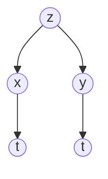

==**14.4**==

Recall the Calc 1 chain rule

$\large y=f(x(t)) \text{ then } \frac{dy}{dt} = \frac{df}{dx}* \frac{dx}{dt}$

Now, suppose that $\large z = f(x,y)$ where $\large x=x(t)$ and $\large y=y(t)$
Notice that y and x are functions of t which makes this a single variable function

Then we can find $\Large \frac{dz}{dt}$ with:
$$\large \frac{dz}{dt} = \frac{\partial z}{\partial x}\frac{dx}{dt} + \frac{\partial z}{\partial y}\frac{dy}{dt}$$
We can use this property to apply the chain rule to functions that contain multiple functions of $\large t$ 

### Example 1

$$\Large z = x^{3}y \text{ , }x=2t \text{ , } y = t^{2}$$
$\large \frac{dz}{dt} = \frac{\partial z}{\partial x}\frac{dx}{dt} + \frac{\partial z}{\partial y}\frac{dy}{dt}$

$\large \frac{dz}{dt} = (3x^{2}y)(2) + (x^{3})(2t)$

Now we substitute so that the only variable on the right is t

$\large \frac{dz}{dt} = 40t^{4}$

### Example 2

A solid right circular cylinder is heated up to that its radius, height and surface area increase

At the instant that $\large r = 10 cm$, $\large h=100cm$, r is increasing at the rate of 0.2 cm/hr and h is increasing at the rate of 0.5 cm/hr. How fast is the surface area changing at this instant?

Note that both the height and radius are dependent on the time.

$\large r = r(t) \text{ , } h=h(t)$ 

We are looking to find the surface area which is dependent on the radius and height

$\large S = S(r,h) = 2\pi r^{2} + 2\pi rh$ 

From here we can easily compute $\Large \frac{dS}{dt}$ 