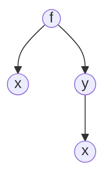
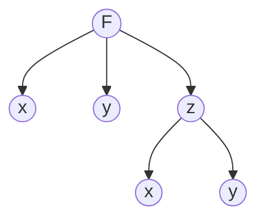

#VecTest1 
# Calc I Imp. Diff. with Calc III

If $\large f(x,y) = 0$ where y implicitly depends on x,
then x is a single independent variable for $\large f(x,y)$

#### Applying the Calc III version of the [[Chain Rule(s)]]

$$\Large\frac{d}{dx}\big[F(x,y)= 0\big]$$
$$\large \frac{\partial F}{\partial x}+ \frac{dF}{dy}\frac{dF}{dx} = 0$$
so $$\large \frac{dy}{dx} = \frac{F_{x}}{F_{y}}$$
### Example 1

Assume $y = y(x)$ Find $\large \frac{dy}{dx}$ of $\large x^{2}y+\sqrt{xy}=4$

$\large F(x,y) = x^{2}y  (xy)^{\frac{1}{2}}-4 = 0$

Now we can apply the formula from earlier

$\large F_{x} = 2xy+ \frac{y}{2\sqrt{xy}}$

$\large F_{y} = 2x^{2} + \frac{x}{2\sqrt{xy}}$

So 

$\Large \frac{dy}{dx} = \frac{-(2xy+ \frac{y}{2\sqrt{xy}})}{2x^{2} + \frac{x}{2\sqrt{xy}}}$

# Calc III Implicit Differentiation

Now, suppose that $\large z = z(x,y)$  is defined implicitly by $\large F(x,y,z) = 0$

Find $\Large\frac{\partial z}{\partial x}$ and $\Large \frac{\partial z}{\partial y}$ 

$\Large \frac{d}{dx} \big[F(x,y,x) = 0\big]$

$\Large \frac{\partial F}{\partial x} + \frac{\partial F}{\partial z}\frac{\partial z}{\partial x} = 0$

So

$\Large\frac{\partial z}{\partial x} = \frac{-F_{x}}{F_{z}}$

and

$\Large \frac{\partial z}{\partial y} = \frac{-F_{y}}{F_{z}}$

### Example

Assume that $\large z = z(x,y)$ and $\large F(x,y,z) = x^{3}e^{y+z}-ysin(x-z)=0$

Find $\large\frac{\partial z}{\partial x}$ and $\large \frac{\partial z}{\partial y}$

$\Large \frac{\partial z}{\partial x} = \frac{-(3x^{2}e^{y+z}-ycos(x-z))}{x^{3}e^{y+z}+ycos(x-z)}$ 

and

$\Large \frac{\partial z}{\partial y} = \frac{-(x^{3}e^{y+z} -sin(x-z))}{x^{3}e^{y+z}+ycos(x-z)}$

